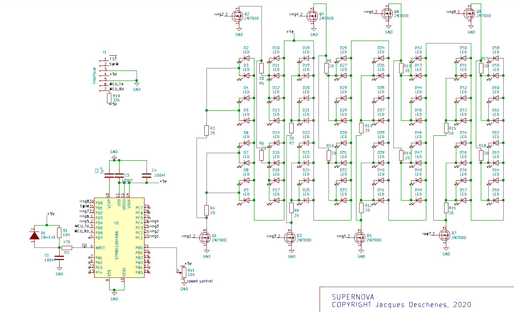

# Serpernova 

Sculpture électronique constitué de 8 anneaux concentriques. Chaque anneau comprend 8 LED bleus. Une explosion de lumière part de l'anneau central vers l'extérieur avec l'intensité diminuant vers l'extérieur. Le cycle se répète indéfiniment. La vitesse du cycle est contrôlée par le potentiomètre RV1.

## schématique

## assemblage électronique sur base en chaîne rouge

